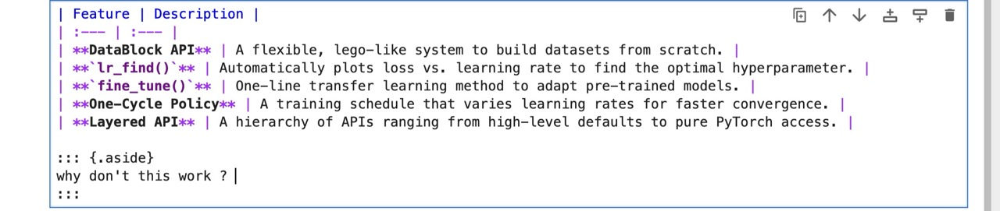

# How to work with Lisette

2024-01-15

## This is how to write some text including some citations as sidenotes

Quarto (abbreviated Qto, 4to or 4º) is the format of a book or pamphlet
produced from full sheets printed with eight pages of text, four to a
side, then folded twice to produce four leaves. The leaves are then
trimmed along the folds to produce eight book pages. Each printed page
presents as one-fourth size of the full sheet.[1]

The earliest known European printed book is a quarto, the Sibyllenbuch,
believed to have been printed by Johannes Gutenberg in 1452–53, before
the Gutenberg Bible, surviving only as a fragment. Quarto is also used
as a general description of size of books that are about 12 inches (30
cm) tall, and as such does not necessarily indicate the actual printing
format of the books, which may even be unknown, as is the case for many
modern books. These terms are discussed in greater detail in book sizes.

``` python
# this is a sample code block to reverse a list 
def reverse_list(list):
    if something_happens:
        print('this happened')
    else:
        print('this happened becuase the other did not')
```

Lines 2-4  
will this code annotation work ? hardly

## This is how to embed an image


<div class="aside">

**Pro Tip:** This dataset was cleaned using the Pandas library before
ingestion.

</div>

## What can we do with lisette lib

### Overview

<table>
<colgroup>
<col style="width: 50%" />
<col style="width: 50%" />
</colgroup>
<thead>
<tr>
<th style="text-align: left;">Feature</th>
<th style="text-align: left;">Description</th>
</tr>
</thead>
<tbody>
<tr>
<td style="text-align: left;"><strong>DataBlock API</strong></td>
<td style="text-align: left;">A flexible, lego-like system to build
datasets from scratch.</td>
</tr>
<tr>
<td
style="text-align: left;"><strong><code>lr_find()</code></strong></td>
<td style="text-align: left;">Automatically plots loss vs. learning rate
to find the optimal hyperparameter.</td>
</tr>
<tr>
<td
style="text-align: left;"><strong><code>fine_tune()</code></strong></td>
<td style="text-align: left;">One-line transfer learning method to adapt
pre-trained models.</td>
</tr>
<tr>
<td style="text-align: left;"><strong>One-Cycle Policy</strong></td>
<td style="text-align: left;">A training schedule that varies learning
rates for faster convergence.</td>
</tr>
<tr>
<td style="text-align: left;"><strong>Layered API</strong></td>
<td style="text-align: left;">A hierarchy of APIs ranging from
high-level defaults to pure PyTorch access.</td>
</tr>
</tbody>
</table>

<div class="aside">



</div>

<div class="aside">

this is the exact code-block used to render this table

</div>

``` python
!uv pip list # this is how you look for what is installed in your environement
```

Imagine you need to write a simple tools(or fuctions).How can you do
that ?. Here is how and it is so easy.

``` python
def adder(a:float,b:float):
    '''This adds two number a and b'''
    return a + b     
```

Line 2  
you always need to add a docstring.

``` python
!uv pip install lisette -qq
```

``` python
from litellm import (acompletion, completion, stream_chunk_builder, Message,
                     ModelResponse, ModelResponseStream, get_model_info, register_model, Usage)
```

``` python
from lisette import *
```

``` python
!uv pip install ipywidgets
```

    Using Python 3.12.8 environment at: /Users/lochana-mbp/q/.venv
    Resolved 20 packages in 793ms                                        
    Installed 3 packages in 17ms.0.16                           
     + ipywidgets==8.1.8
     + jupyterlab-widgets==3.0.16
     + widgetsnbextension==4.0.15

``` python
import os 
from dotenv import load_dotenv
```

``` python
load_dotenv()
```

    True

``` python
model = 'gemini/gemini-2.5-pro'
```

``` python
c = Chat(model)
```

``` python
res = c('What is the capital of Australia')
```

``` python
from lisette.core import Chat
from fastcore.utils import patch
import ipywidgets as widgets
from IPython.display import display, clear_output

@patch
def edit_last(self: Chat):
    """
    Displays an interactive widget to edit the last message in history.
    Updates the Chat history in-place upon clicking 'Update'.
    """
    if not self.hist:
        print("No history to edit.")
        return

    # 1. Get the last message object
    last_msg = self.hist[-1]
    
    # 2. Extract current content safely (handle dict vs object)
    if isinstance(last_msg, dict):
        current_content = last_msg.get('content', '')
    else:
        # It is a litellm Message object
        current_content = getattr(last_msg, 'content', '')
        
    # Guard against non-text content (like tool calls or images)
    if not isinstance(current_content, str):
        print(f"Cannot edit content type: {type(current_content)}")
        return

    # 3. Create Widgets
    textarea = widgets.Textarea(
        value=current_content,
        placeholder='Type something...',
        description='Edit:',
        layout=widgets.Layout(width='100%', height='200px')
    )
    
    save_btn = widgets.Button(
        description='Update History',
        button_style='success', # 'success', 'info', 'warning', 'danger' or ''
        icon='check'
    )
    
    out_log = widgets.Output()

    # 4. Define Save Action
    def on_save(_):
        new_text = textarea.value
        
        # Update the history object in-place
        if isinstance(last_msg, dict):
            last_msg['content'] = new_text
        else:
            last_msg.content = new_text
            
        with out_log:
            clear_output()
            print("✅ History updated successfully!")
            
    save_btn.on_click(on_save)

    # 5. Display
    display(widgets.VBox([textarea, save_btn, out_log]))
```

``` python
from litellm import (acompletion, completion, stream_chunk_builder, Message,
                     ModelResponse, ModelResponseStream, get_model_info, register_model, Usage)
```

``` python
from IPython.display import Markdown, Image
```

``` python
from litellm import ModelResponse
```

``` python
def _response(self: litellm.ModelResponse):
    response = self.model_dump.get('choices')[0]['message']['content']
    return response
```

    NameError: name 'litellm' is not defined
    ---------------------------------------------------------------------------
    NameError                                 Traceback (most recent call last)
    Cell In[90], line 1
    ----> 1 def _response(self: litellm.ModelResponse):
          2     response = self.model_dump.get('choices')[0]['message']['content']
          3     return response

    NameError: name 'litellm' is not defined

``` python
res.model_dump()
```

    {'id': '6BsxabbaJoGL4-EP146qiQE',
     'created': 1764826083,
     'model': 'gemini-2.5-pro',
     'object': 'chat.completion',
     'system_fingerprint': None,
     'choices': [{'finish_reason': 'stop',
       'index': 0,
       'message': {'content': "The capital of Australia is **Canberra**.\n\nA common misconception is that it's Sydney or Melbourne, as they are the country's largest and most well-known cities. However, Canberra was chosen as a compromise between these two rivals in 1908.",
        'role': 'assistant',
        'tool_calls': None,
        'function_call': None,
        'images': [],
        'thinking_blocks': [],
        'provider_specific_fields': None}}],
     'usage': {'completion_tokens': 520,
      'prompt_tokens': 7,
      'total_tokens': 527,
      'completion_tokens_details': {'accepted_prediction_tokens': None,
       'audio_tokens': None,
       'reasoning_tokens': 464,
       'rejected_prediction_tokens': None,
       'text_tokens': 56,
       'image_tokens': None},
      'prompt_tokens_details': {'audio_tokens': None,
       'cached_tokens': None,
       'text_tokens': 7,
       'image_tokens': None}},
     'vertex_ai_grounding_metadata': [],
     'vertex_ai_url_context_metadata': [],
     'vertex_ai_safety_results': [],
     'vertex_ai_citation_metadata': []}

``` python
model_dump = res.model_dump()
y =model_dump.get('choices')[0]['message']['content']
y
```

    "The capital of Australia is **Canberra**.\n\nA common misconception is that it's Sydney or Melbourne, as they are the country's largest and most well-known cities. However, Canberra was chosen as a compromise between these two rivals in 1908."

``` python
dir(res)
```

    ['__abstractmethods__',
     '__annotations__',
     '__class__',
     '__class_getitem__',
     '__class_vars__',
     '__contains__',
     '__copy__',
     '__deepcopy__',
     '__delattr__',
     '__dict__',
     '__dir__',
     '__doc__',
     '__eq__',
     '__fields__',
     '__fields_set__',
     '__format__',
     '__ge__',
     '__get_pydantic_core_schema__',
     '__get_pydantic_json_schema__',
     '__getattr__',
     '__getattribute__',
     '__getitem__',
     '__getstate__',
     '__gt__',
     '__hash__',
     '__init__',
     '__init_subclass__',
     '__iter__',
     '__le__',
     '__lt__',
     '__module__',
     '__ne__',
     '__new__',
     '__pretty__',
     '__private_attributes__',
     '__pydantic_complete__',
     '__pydantic_computed_fields__',
     '__pydantic_core_schema__',
     '__pydantic_custom_init__',
     '__pydantic_decorators__',
     '__pydantic_extra__',
     '__pydantic_fields__',
     '__pydantic_fields_set__',
     '__pydantic_generic_metadata__',
     '__pydantic_init_subclass__',
     '__pydantic_on_complete__',
     '__pydantic_parent_namespace__',
     '__pydantic_post_init__',
     '__pydantic_private__',
     '__pydantic_root_model__',
     '__pydantic_serializer__',
     '__pydantic_setattr_handlers__',
     '__pydantic_validator__',
     '__reduce__',
     '__reduce_ex__',
     '__replace__',
     '__repr__',
     '__repr_args__',
     '__repr_name__',
     '__repr_recursion__',
     '__repr_str__',
     '__rich_repr__',
     '__setattr__',
     '__setstate__',
     '__signature__',
     '__sizeof__',
     '__slots__',
     '__str__',
     '__subclasshook__',
     '__weakref__',
     '_abc_impl',
     '_calculate_keys',
     '_copy_and_set_values',
     '_get_value',
     '_iter',
     '_repr_markdown_',
     '_response_ms',
     '_setattr_handler',
     'choices',
     'construct',
     'copy',
     'created',
     'dict',
     'from_orm',
     'get',
     'id',
     'json',
     'model',
     'model_computed_fields',
     'model_config',
     'model_construct',
     'model_copy',
     'model_dump',
     'model_dump_json',
     'model_extra',
     'model_fields',
     'model_fields_set',
     'model_json_schema',
     'model_parametrized_name',
     'model_post_init',
     'model_rebuild',
     'model_validate',
     'model_validate_json',
     'model_validate_strings',
     'object',
     'parse_file',
     'parse_obj',
     'parse_raw',
     'schema',
     'schema_json',
     'system_fingerprint',
     'to_dict',
     'to_json',
     'update_forward_refs',
     'validate']

``` python
list_of_choices
```

    [{'finish_reason': 'stop',
      'index': 0,
      'message': {'content': "The capital of Australia is **Canberra**.\n\nA common misconception is that it's Sydney or Melbourne, as they are the country's largest and most well-known cities. However, Canberra was chosen as a compromise between these two rivals in 1908.",
       'role': 'assistant',
       'tool_calls': None,
       'function_call': None,
       'images': [],
       'thinking_blocks': [],
       'provider_specific_fields': None}}]

``` python
k = Chat(model)
```

``` python
res = k('what is the capital of sri lanka')
```

``` python
res.hist
```

    AttributeError: 'ModelResponse' object has no attribute 'hist'
    ---------------------------------------------------------------------------
    AttributeError                            Traceback (most recent call last)
    Cell In[100], line 1
    ----> 1 res.hist

    File ~/q/.venv/lib/python3.12/site-packages/pydantic/main.py:1026, in BaseModel.__getattr__(self, item)
       1023     return super().__getattribute__(item)  # Raises AttributeError if appropriate
       1024 else:
       1025     # this is the current error
    -> 1026     raise AttributeError(f'{type(self).__name__!r} object has no attribute {item!r}')

    AttributeError: 'ModelResponse' object has no attribute 'hist'

## Import Cachy

``` python
from cachy import enable_cachy
enable_cachy()
```

``` python
res = c('This is nice,can you tell me a joke?')
res
```

Of course!

Why don’t scientists trust atoms?

…Because they make up everything! 😄

<details>

- id: `YbwwaeaPMd7ijuMPrIGt2A0`
- model: `gemini-2.5-pro`
- finish_reason: `stop`
- usage:
  `Usage(completion_tokens=556, prompt_tokens=25, total_tokens=581, completion_tokens_details=CompletionTokensDetailsWrapper(accepted_prediction_tokens=None, audio_tokens=None, reasoning_tokens=535, rejected_prediction_tokens=None, text_tokens=21, image_tokens=None), prompt_tokens_details=PromptTokensDetailsWrapper(audio_tokens=None, cached_tokens=None, text_tokens=25, image_tokens=None))`

</details>

## Ok now if we try to do the same prompt again what would happen?

``` python
res_2 = c('This is nice,can you tell me a joke?')
res_2
```

Glad you liked it! Here’s another one for you:

What do you call a fake noodle?

…An impasta! 😉

<details>

- id: `srwwafe4EofKg8UPjvDlkQ4`
- model: `gemini-2.5-pro`
- finish_reason: `stop`
- usage:
  `Usage(completion_tokens=544, prompt_tokens=59, total_tokens=603, completion_tokens_details=CompletionTokensDetailsWrapper(accepted_prediction_tokens=None, audio_tokens=None, reasoning_tokens=515, rejected_prediction_tokens=None, text_tokens=29, image_tokens=None), prompt_tokens_details=PromptTokensDetailsWrapper(audio_tokens=None, cached_tokens=None, text_tokens=59, image_tokens=None))`

</details>

I think you need `patch_litellm()`

``` python
patch_litellm()
```

``` python
first = c('Tell me about Sri Lanka')
```

``` python
first
```

Of course! Sri Lanka is a fascinating and beautiful country with a rich
history and diverse culture. Here’s a comprehensive overview for you.

### **An Introduction to Sri Lanka**

Often called the **“Pearl of the Indian Ocean”** or the **“Resplendent
Isle,”** Sri Lanka is a teardrop-shaped island nation located just south
of India. It’s a country of incredible diversity packed into a
relatively small area. You can go from sun-drenched beaches to cool,
misty mountains covered in tea plantations in just a few hours.

------------------------------------------------------------------------

### **Key Aspects of Sri Lanka**

#### **1. Geography and Nature**

- **Diverse Landscapes:** The coastal belt is lined with stunning
  beaches and lagoons. The interior features a central highland region
  with mountains, waterfalls, and vast tea estates. The northern and
  eastern parts are flatter and drier.
- **Incredible Wildlife:** Sri Lanka is one of the world’s top
  biodiversity hotspots. It’s famous for its large population of **Asian
  elephants**, which can be seen in national parks like Udawalawe and
  Minneriya. It’s also one of the best places in the world to spot
  **leopards** (in Yala National Park) and **blue whales** (off the
  southern coast near Mirissa).
- **National Parks:** The country has numerous protected areas,
  including Sinharaja Forest Reserve, a UNESCO World Heritage Site and
  the last viable area of primary tropical rainforest in the country.

#### **2. History and Culture**

- **Ancient Roots:** Sri Lanka has a documented history of over 2,500
  years. The ancient cities of **Anuradhapura** and **Polonnaruwa** were
  magnificent capitals with enormous stupas (dome-shaped Buddhist
  shrines) and advanced irrigation systems.
- **The Cultural Triangle:** This area in the center of the country is
  home to several UNESCO World Heritage Sites, including:
  - **Sigiriya Rock Fortress:** An ancient palace and fortress built
    atop a massive rock column, famous for its stunning frescoes.
  - **Dambulla Cave Temple:** A complex of caves filled with hundreds of
    Buddha statues and intricate paintings.
  - **The Sacred City of Kandy:** Home to the Temple of the Tooth Relic,
    which houses a sacred tooth of the Buddha.
- **Colonial Influence:** The island was colonized by the Portuguese,
  Dutch, and finally the British, who introduced tea cultivation on a
  massive scale. This colonial past is visible in the architecture of
  cities like **Galle**, with its famous Dutch Fort.
- **People and Religion:** The majority of the population is
  **Sinhalese** (mostly Buddhist), with a significant **Tamil** minority
  (mostly Hindu). There are also Muslim and Christian communities. This
  mix of cultures makes for a vibrant tapestry of festivals, traditions,
  and languages (Sinhala and Tamil are the official languages).

#### **3. The Economy and Famous Exports**

- **Ceylon Tea:** Sri Lanka (formerly known as Ceylon) is one of the
  world’s largest tea exporters. A visit to the hill country isn’t
  complete without a tour of a tea plantation.
- **Spices:** The island has been a hub for the spice trade for
  centuries. It’s famous for its high-quality **cinnamon**, as well as
  cloves, nutmeg, and pepper.
- **Gems:** Known as the “Gem Island,” Sri Lanka is a source of
  beautiful sapphires, rubies, and other precious stones.
- **Tourism:** Tourism is a vital part of the economy, attracting
  visitors with its blend of nature, culture, adventure, and wellness.

#### **4. Food**

Sri Lankan cuisine is a treat! It’s known for its vibrant colors and
rich, spicy flavors. \* **Rice and Curry:** This is the national dish,
but it’s not just one curry. It’s a plate of rice served with a variety
of small, flavorful dishes made from vegetables, meat, or fish, often
using coconut milk and a unique blend of spices. \* **Kottu Roti:** A
popular street food made from chopped flatbread, vegetables, egg, and/or
meat, all stir-fried on a hot griddle with a rhythmic clanging of metal
blades. \* **Hoppers (Appa):** Bowl-shaped pancakes made from fermented
rice flour and coconut milk. They are crispy on the edges and soft in
the center, often served with an egg cooked inside (**Egg Hopper**). \*
**String Hoppers (Idiyappam):** Steamed nests of rice flour noodles,
usually eaten for breakfast with a coconut sambol and curry.

------------------------------------------------------------------------

### **Recent History**

It’s also important to acknowledge that Sri Lanka has faced significant
challenges. The country endured a long and painful civil war from 1983
to 2009. In recent years, it has also faced economic difficulties.
Despite these hardships, the people are known for their resilience,
warmth, and hospitality.

In short, Sri Lanka is a land of contrasts and immense beauty, offering
everything from ancient history and spiritual sites to thrilling
wildlife safaris and relaxing beach holidays.

<details>

- id: `chatcmpl-xxx`
- model: `gemini-2.5-pro`
- finish_reason: `stop`
- usage:
  `Usage(completion_tokens=2564, prompt_tokens=95, total_tokens=2659, completion_tokens_details=CompletionTokensDetailsWrapper(accepted_prediction_tokens=None, audio_tokens=None, reasoning_tokens=1471, rejected_prediction_tokens=None, text_tokens=1093, image_tokens=None), prompt_tokens_details=PromptTokensDetailsWrapper(audio_tokens=None, cached_tokens=None, text_tokens=95, image_tokens=None))`

</details>

``` python
# now let's see how cached response work 
cached_response = c('Tell me about Sri Lanka')
cached_response
```

You got it! Since we’ve covered the general overview, let’s dive into
some of the most unique and fascinating facts about Sri Lanka.

Here are some things that make the island truly special:

**1. The Origin of the Word “Serendipity”** The English word
“serendipity,” which means a fortunate or happy accident, comes from
*Serendib*, an old Arabic name for Sri Lanka. The term was coined by
Horace Walpole in 1754, inspired by a Persian fairy tale about three
princes from Serendib who were always making discoveries by accident.

**2. Home to the World’s First Female Prime Minister** In 1960, Sri
Lanka (then Ceylon) made history when Sirimavo Bandaranaike became the
world’s first-ever female head of government.

**3. The National Flag is One of the Oldest in the World** The Sri
Lankan flag is rich with symbolism. The golden lion represents the
Sinhalese people, the four Bo leaves in the corners represent the four
Buddhist virtues, and the orange and green stripes represent the Tamil
and Muslim minorities, respectively.

**4. It’s the True Home of Cinnamon** While many countries use cinnamon,
the “true cinnamon” (*Cinnamomum verum*) is native to Sri Lanka. For
centuries, the island was the world’s primary source, making it a
priceless hub for spice traders.

**5. The National Sport Isn’t Cricket** Although cricket is wildly
popular and the country has a world-class team, the official national
sport of Sri Lanka is actually **volleyball**.

**6. A Haven for Elephants** Sri Lanka has the highest density of wild
Asian elephants in the world. Every year, hundreds of elephants gather
at the Minneriya National Park in an event known as “The Gathering,”
which is the largest meeting of Asian elephants on the planet.

**7. The Sacred Tooth of the Buddha** The city of Kandy is home to the
*Sri Dalada Maligawa* (Temple of the Sacred Tooth Relic). This temple
houses what is believed to be a real tooth of the Buddha, making it one
of the most sacred pilgrimage sites for Buddhists worldwide.

**8. A Very High Literacy Rate** Despite its economic challenges, Sri
Lanka boasts one of the highest literacy rates in South Asia, at over
92%. Education is highly valued in the culture.

Is there any of these points you’d find interesting to explore further?
For example, we could talk more about the history of the spice trade or
the significance of the Temple of the Tooth.

<details>

- id: `chatcmpl-xxx`
- model: `gemini-2.5-pro`
- finish_reason: `stop`
- usage:
  `Usage(completion_tokens=1617, prompt_tokens=1677, total_tokens=3294, completion_tokens_details=CompletionTokensDetailsWrapper(accepted_prediction_tokens=None, audio_tokens=None, reasoning_tokens=1068, rejected_prediction_tokens=None, text_tokens=549, image_tokens=None), prompt_tokens_details=PromptTokensDetailsWrapper(audio_tokens=None, cached_tokens=None, text_tokens=1677, image_tokens=None))`

</details>

``` python
dir(Chat)
```

    ['__call__',
     '__class__',
     '__delattr__',
     '__dict__',
     '__dir__',
     '__doc__',
     '__eq__',
     '__format__',
     '__ge__',
     '__getattribute__',
     '__getstate__',
     '__gt__',
     '__hash__',
     '__init__',
     '__init_subclass__',
     '__le__',
     '__lt__',
     '__module__',
     '__ne__',
     '__new__',
     '__reduce__',
     '__reduce_ex__',
     '__repr__',
     '__setattr__',
     '__sizeof__',
     '__str__',
     '__subclasshook__',
     '__weakref__',
     '_call',
     '_prep_msg',
     'print_hist']

``` python
display(c.print_hist())
```

    {'role': 'user', 'content': 'hey'}

    Message(content='Hey there! How can I help you today?', role='assistant', tool_calls=None, function_call=None, images=[], thinking_blocks=[], provider_specific_fields=None)

    {'role': 'user', 'content': 'This is nice,can you tell me a joke?'}

    Message(content="Of course!\n\nWhy don't scientists trust atoms?\n\n...Because they make up everything! 😄", role='assistant', tool_calls=None, function_call=None, images=[], thinking_blocks=[], provider_specific_fields=None)

    {'role': 'user', 'content': 'This is nice,can you tell me a joke?'}

    Message(content="Glad you liked it! Here's another one for you:\n\nWhat do you call a fake noodle?\n\n...An impasta! 😉", role='assistant', tool_calls=None, function_call=None, images=[], thinking_blocks=[], provider_specific_fields=None)

    {'role': 'user', 'content': 'Tell me about Sri Lanka'}

    Message(content='Of course! Sri Lanka is a fascinating and beautiful country with a rich history and diverse culture. Here’s a comprehensive overview for you.\n\n### **An Introduction to Sri Lanka**\n\nOften called the **"Pearl of the Indian Ocean"** or the **"Resplendent Isle,"** Sri Lanka is a teardrop-shaped island nation located just south of India. It\'s a country of incredible diversity packed into a relatively small area. You can go from sun-drenched beaches to cool, misty mountains covered in tea plantations in just a few hours.\n\n---\n\n### **Key Aspects of Sri Lanka**\n\n#### **1. Geography and Nature**\n*   **Diverse Landscapes:** The coastal belt is lined with stunning beaches and lagoons. The interior features a central highland region with mountains, waterfalls, and vast tea estates. The northern and eastern parts are flatter and drier.\n*   **Incredible Wildlife:** Sri Lanka is one of the world\'s top biodiversity hotspots. It\'s famous for its large population of **Asian elephants**, which can be seen in national parks like Udawalawe and Minneriya. It\'s also one of the best places in the world to spot **leopards** (in Yala National Park) and **blue whales** (off the southern coast near Mirissa).\n*   **National Parks:** The country has numerous protected areas, including Sinharaja Forest Reserve, a UNESCO World Heritage Site and the last viable area of primary tropical rainforest in the country.\n\n#### **2. History and Culture**\n*   **Ancient Roots:** Sri Lanka has a documented history of over 2,500 years. The ancient cities of **Anuradhapura** and **Polonnaruwa** were magnificent capitals with enormous stupas (dome-shaped Buddhist shrines) and advanced irrigation systems.\n*   **The Cultural Triangle:** This area in the center of the country is home to several UNESCO World Heritage Sites, including:\n    *   **Sigiriya Rock Fortress:** An ancient palace and fortress built atop a massive rock column, famous for its stunning frescoes.\n    *   **Dambulla Cave Temple:** A complex of caves filled with hundreds of Buddha statues and intricate paintings.\n    *   **The Sacred City of Kandy:** Home to the Temple of the Tooth Relic, which houses a sacred tooth of the Buddha.\n*   **Colonial Influence:** The island was colonized by the Portuguese, Dutch, and finally the British, who introduced tea cultivation on a massive scale. This colonial past is visible in the architecture of cities like **Galle**, with its famous Dutch Fort.\n*   **People and Religion:** The majority of the population is **Sinhalese** (mostly Buddhist), with a significant **Tamil** minority (mostly Hindu). There are also Muslim and Christian communities. This mix of cultures makes for a vibrant tapestry of festivals, traditions, and languages (Sinhala and Tamil are the official languages).\n\n#### **3. The Economy and Famous Exports**\n*   **Ceylon Tea:** Sri Lanka (formerly known as Ceylon) is one of the world\'s largest tea exporters. A visit to the hill country isn\'t complete without a tour of a tea plantation.\n*   **Spices:** The island has been a hub for the spice trade for centuries. It\'s famous for its high-quality **cinnamon**, as well as cloves, nutmeg, and pepper.\n*   **Gems:** Known as the "Gem Island," Sri Lanka is a source of beautiful sapphires, rubies, and other precious stones.\n*   **Tourism:** Tourism is a vital part of the economy, attracting visitors with its blend of nature, culture, adventure, and wellness.\n\n#### **4. Food**\nSri Lankan cuisine is a treat! It\'s known for its vibrant colors and rich, spicy flavors.\n*   **Rice and Curry:** This is the national dish, but it\'s not just one curry. It\'s a plate of rice served with a variety of small, flavorful dishes made from vegetables, meat, or fish, often using coconut milk and a unique blend of spices.\n*   **Kottu Roti:** A popular street food made from chopped flatbread, vegetables, egg, and/or meat, all stir-fried on a hot griddle with a rhythmic clanging of metal blades.\n*   **Hoppers (Appa):** Bowl-shaped pancakes made from fermented rice flour and coconut milk. They are crispy on the edges and soft in the center, often served with an egg cooked inside (**Egg Hopper**).\n*   **String Hoppers (Idiyappam):** Steamed nests of rice flour noodles, usually eaten for breakfast with a coconut sambol and curry.\n\n---\n\n### **Recent History**\n\nIt\'s also important to acknowledge that Sri Lanka has faced significant challenges. The country endured a long and painful civil war from 1983 to 2009. In recent years, it has also faced economic difficulties. Despite these hardships, the people are known for their resilience, warmth, and hospitality.\n\nIn short, Sri Lanka is a land of contrasts and immense beauty, offering everything from ancient history and spiritual sites to thrilling wildlife safaris and relaxing beach holidays.', role='assistant', tool_calls=None, function_call=None, images=[], thinking_blocks=[], provider_specific_fields=None)

    {'role': 'user', 'content': 'Tell me about Sri Lanka'}

    Message(content='Of course! We just touched on it, but I can give you a more focused summary or dive deeper into a specific area.\n\nHere\'s a quick, "at-a-glance" look at Sri Lanka:\n\n**Sri Lanka: The Essentials**\n\n*   **Nickname:** The Pearl of the Indian Ocean.\n*   **Location:** An island nation in the Indian Ocean, southeast of India.\n*   **Capital Cities:**\n    *   **Colombo:** The commercial and largest city.\n    *   **Sri Jayawardenepura Kotte:** The official administrative capital.\n*   **People:** A diverse mix of cultures, primarily the Sinhalese (mostly Buddhist) and Tamils (mostly Hindu), with significant Muslim and Christian communities.\n\n**What is Sri Lanka Famous For?**\n\n1.  **The Cultural Triangle:** This is the historical heart of the country, home to incredible UNESCO World Heritage sites like the **Sigiriya Rock Fortress**, the ancient cities of **Anuradhapura** and **Polonnaruwa**, and the **Dambulla Cave Temples**.\n\n2.  **Ceylon Tea:** The cool, misty hill country around cities like Nuwara Eliya and Ella is covered in lush green tea plantations. Sri Lanka is one of the world\'s top tea producers.\n\n3.  **Incredible Wildlife:** It\'s one of the best places in Asia for wildlife safaris. You can see huge herds of elephants in **Udawalawe National Park**, leopards in **Yala National Park**, and blue whales off the coast of **Mirissa**.\n\n4.  **Beautiful Beaches:** The coastline is lined with golden-sand beaches, from the bustling surf spots in the south (like Weligama and Hikkaduwa) to the more tranquil shores of the east coast (like Trincomalee and Arugam Bay).\n\n5.  **Delicious Food:** The cuisine is famous for its aromatic spices. The staple dish is **rice and curry**, but street food like **kottu roti** (chopped flatbread stir-fry) is a must-try.\n\nIs there a particular part of that you\'d like to know more about? For example, are you interested in travel tips, its history, the food, or its wildlife?', role='assistant', tool_calls=None, function_call=None, images=[], thinking_blocks=[], provider_specific_fields=None)

    {'role': 'user', 'content': 'Tell me about Sri Lanka'}

    Message(content='You got it! Since we\'ve covered the general overview, let\'s dive into some of the most unique and fascinating facts about Sri Lanka.\n\nHere are some things that make the island truly special:\n\n**1. The Origin of the Word "Serendipity"**\nThe English word "serendipity," which means a fortunate or happy accident, comes from *Serendib*, an old Arabic name for Sri Lanka. The term was coined by Horace Walpole in 1754, inspired by a Persian fairy tale about three princes from Serendib who were always making discoveries by accident.\n\n**2. Home to the World\'s First Female Prime Minister**\nIn 1960, Sri Lanka (then Ceylon) made history when Sirimavo Bandaranaike became the world\'s first-ever female head of government.\n\n**3. The National Flag is One of the Oldest in the World**\nThe Sri Lankan flag is rich with symbolism. The golden lion represents the Sinhalese people, the four Bo leaves in the corners represent the four Buddhist virtues, and the orange and green stripes represent the Tamil and Muslim minorities, respectively.\n\n**4. It\'s the True Home of Cinnamon**\nWhile many countries use cinnamon, the "true cinnamon" (*Cinnamomum verum*) is native to Sri Lanka. For centuries, the island was the world\'s primary source, making it a priceless hub for spice traders.\n\n**5. The National Sport Isn\'t Cricket**\nAlthough cricket is wildly popular and the country has a world-class team, the official national sport of Sri Lanka is actually **volleyball**.\n\n**6. A Haven for Elephants**\nSri Lanka has the highest density of wild Asian elephants in the world. Every year, hundreds of elephants gather at the Minneriya National Park in an event known as "The Gathering," which is the largest meeting of Asian elephants on the planet.\n\n**7. The Sacred Tooth of the Buddha**\nThe city of Kandy is home to the *Sri Dalada Maligawa* (Temple of the Sacred Tooth Relic). This temple houses what is believed to be a real tooth of the Buddha, making it one of the most sacred pilgrimage sites for Buddhists worldwide.\n\n**8. A Very High Literacy Rate**\nDespite its economic challenges, Sri Lanka boasts one of the highest literacy rates in South Asia, at over 92%. Education is highly valued in the culture.\n\nIs there any of these points you\'d find interesting to explore further? For example, we could talk more about the history of the spice trade or the significance of the Temple of the Tooth.', role='assistant', tool_calls=None, function_call=None, images=[], thinking_blocks=[], provider_specific_fields=None)

    None

``` python
patch_litellm(seed=42)
pr = 'tell me a joke'
```

``` python
j = Chat(model)
first_joke = j(pr)
first_joke
```

Why don’t scientists trust atoms?

Because they make up everything

<details>

- id: `chatcmpl-xxx`
- model: `gemini-2.5-pro`
- finish_reason: `stop`
- usage:
  `Usage(completion_tokens=556, prompt_tokens=5, total_tokens=561, completion_tokens_details=CompletionTokensDetailsWrapper(accepted_prediction_tokens=None, audio_tokens=None, reasoning_tokens=542, rejected_prediction_tokens=None, text_tokens=14, image_tokens=None), prompt_tokens_details=PromptTokensDetailsWrapper(audio_tokens=None, cached_tokens=None, text_tokens=5, image_tokens=None))`

</details>

``` python
second_joke = j(pr)
second_joke
```

I’m reading a book on anti-gravity.

It’s impossible to put down

<details>

- id: `chatcmpl-xxx`
- model: `gemini-2.5-pro`
- finish_reason: `stop`
- usage:
  `Usage(completion_tokens=788, prompt_tokens=25, total_tokens=813, completion_tokens_details=CompletionTokensDetailsWrapper(accepted_prediction_tokens=None, audio_tokens=None, reasoning_tokens=769, rejected_prediction_tokens=None, text_tokens=19, image_tokens=None), prompt_tokens_details=PromptTokensDetailsWrapper(audio_tokens=None, cached_tokens=None, text_tokens=25, image_tokens=None))`

</details>

[1] If this is working that is really nice.
